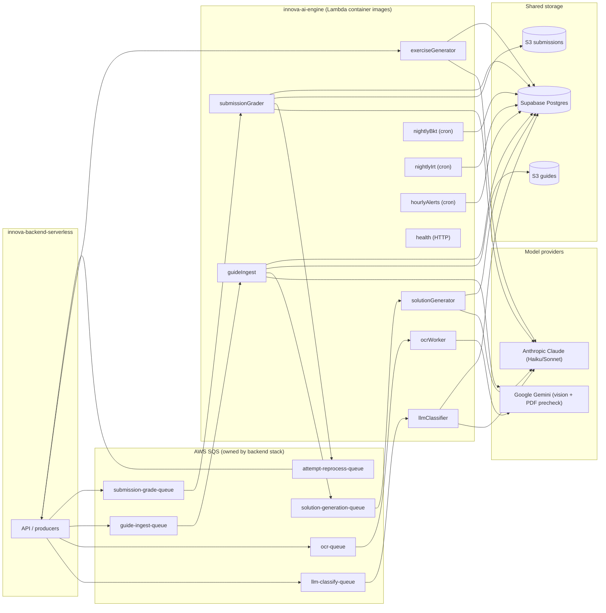

Innova AI Engine sits at the asynchronous processing layer of the SuperProfe platform. The `innova-backend-serverless` API handles all synchronous student and teacher interactions, and when a task requires ML inference — classifying an error, grading a submission, extracting questions from a PDF — the backend enqueues a message to one of its SQS queues. The engine picks up that message, calls the appropriate model provider or runs a mathematical calibration, and writes structured results back to the shared Postgres database. No result is ever returned synchronously to the API; the backend's own polling and webhook mechanisms surface results to the frontend after the engine has written them.

## Pipeline diagram

The following diagram shows all message flows between the backend API, the SQS queues, the ten Lambda functions, the model providers, and the shared storage layer:



## Lambda function reference

`serverless.yml` defines ten functions. All are deployed as container images built from the same `Dockerfile.lambda`, with the handler module set per-function via the `command` override:

| Function | Trigger | Purpose | Timeout | Memory |
|----------|---------|---------|---------|--------|
| `health` | HTTP GET `/health` | Liveness probe | 10 s | 128 MB |
| `llmClassifier` | SQS `llm-classify-queue` (batch 20) | Classify `UNCLASSIFIED` attempts via Claude Haiku with prompt caching and forced `tool_use` | 300 s | 512 MB |
| `ocrWorker` | SQS `ocr-queue` (batch 5) | Transcribe handwritten math — Gemini primary, Claude vision escalation | 60 s | 512 MB |
| `guideIngest` | SQS `guide-ingest-queue` (batch 1) | Extract questions from a worksheet PDF (Gemini precheck → Claude → pypdfium2 figures) | 600 s | 2048 MB |
| `solutionGenerator` | SQS `solution-generation-queue` (batch 1) | Build step-by-step solution key for all extracted questions | 600 s | 1024 MB |
| `submissionGrader` | SQS `submission-grade-queue` (batch 5) | Transcribe and grade student photo submissions; republish to `attempt-reprocess` | 120 s | 512 MB |
| `exerciseGenerator` | SQS (batch 1) | Generate new exercises for a topic on teacher demand via Claude Haiku | 300 s | 512 MB |
| `nightlyBkt` | EventBridge `cron(0 7 * * ? *)` | Recalibrate BKT parameters (grid search, step 0.05) across all topics | 900 s | 1024 MB |
| `nightlyIrt` | EventBridge `cron(15 7 * * ? *)` | Recalibrate IRT 2PL item parameters (L-BFGS-B MLE) for exercises with ≥50 attempts | 900 s | 1024 MB |
| `hourlyAlerts` | EventBridge `cron(0 * * * ? *)` | Detect at-risk students, raise deduplicated `TeacherAlert` records | 900 s | 1024 MB |

<Note>
  `adhoc_solver` (A10) exists in `src/adhoc_solver/` but is **not wired as a function** in `serverless.yml`. It is a follow-up feature for ad-hoc scan solving without a guide context and will be added to the function list when it reaches production readiness.
</Note>

## Clean Architecture layers

Every worker package in `src/` follows the same four-layer structure. The dependency arrow always points inward — the domain never imports adapters, and adapters never import domain logic:

### 1. Domain (`domain.py`) — pure logic

Contains all business rules and mathematical algorithms with zero I/O and zero framework imports. Examples:

- `src/bkt/domain.py` — BKT grid search over `(p_l0, p_transit, p_slip, p_guess)` minimizing negative log-likelihood.
- `src/irt/domain.py` — IRT 2PL MLE fitting with `scipy.optimize.minimize` (L-BFGS-B), Fisher information `I(θ) = a²·P(θ)·(1−P(θ))`.
- `src/llm_classifier/domain.py` — batch construction, Claude tool-use schema, result parsing and confidence logic.
- `src/submission_grader/domain.py` — grading rubric evaluation, transcription confidence gating.

Because domain functions are pure (no side effects), they are directly unit-testable with `pytest` and property-testable with `hypothesis`.

### 2. Ports (`ports.py`) — I/O contracts

Defines Python `Protocol` classes that describe exactly what each piece of I/O looks like. The domain depends on ports, not on concrete libraries:

```python
# Example structural protocol
class AttemptRepoPort(Protocol):
    async def fetch_attempts_for_topic(self, topic_id: str) -> list[Attempt]: ...
    async def write_bkt_params(self, topic_id: str, params: BktParams) -> None: ...
```

Adapters satisfy these protocols at runtime (structural typing — no explicit `implements`). Test doubles also satisfy them, allowing unit tests to pass mock objects that fulfil the protocol shape.

### 3. Adapters (`src/shared/`) — concrete I/O

Concrete implementations of the port protocols:

| Adapter | Port it satisfies | External dependency |
|---------|-------------------|---------------------|
| `asyncpg_repo.py` | `AttemptRepoPort`, `GuideRepoPort`, … | `asyncpg` connection pool |
| `sqs_adapter.py` | `QueuePublisherPort` | `boto3` SQS client |
| `s3_adapter.py` | `ObjectStorePort` | `boto3` S3 client |
| `anthropic_adapter.py` | `LLMClassifierPort`, `GraderPort`, … | `anthropic` SDK |
| `gemini_adapter.py` | `MathOCRPort`, `PDFPrecheckPort` | `google-genai` SDK |

Adapters are the **only** files that import external libraries. This means dependency upgrades, provider swaps, or mocking in tests never touch domain logic.

### 4. Pipeline handler (`src/pipeline/<worker>.handler`) — Lambda entrypoint

A thin function that:

1. Reads the Lambda `event` and `context` parameters.
2. Loads `Settings` from `src/shared/settings.py` (validated by `pydantic-settings`, sourced from environment variables).
3. Instantiates adapters using those settings.
4. Calls the domain with the concrete adapters injected via the port protocols.
5. Returns (or raises for SQS `ReportBatchItemFailures`).

No business logic belongs here. The handler is intentionally so thin that it can be tested by invoking it with a crafted event dict and asserting on Postgres state via the adapter.

## The guides pipeline (v9)

The document AI pipeline is the most complex multi-step flow in the engine. It chains three Lambda functions via two SQS hops:

```
guideIngest → [solution-generation-queue] → solutionGenerator → [Postgres REVIEW state]
                                                                         ↓
                                         (student uploads photos)
                                                                         ↓
submissionGrader → [attempt-reprocess-queue] → innova-backend-serverless API
```

**Step 1 — guideIngest** (triggered by `guide-ingest-queue`):
1. Downloads the PDF from `S3_GUIDES_BUCKET`.
2. Runs a Gemini precheck to assess whether the document is a math worksheet.
3. Chunks the PDF into pages (default 20 pages with 1-page overlap, configurable via `GUIDE_INGEST_CHUNK_PAGES` / `GUIDE_INGEST_CHUNK_OVERLAP`).
4. Calls Claude (Sonnet) to extract structured questions from each chunk.
5. Renders embedded figures using `pypdfium2` and attaches them to extracted questions.
6. Validates overall extraction quality against `GUIDE_MIN_EXTRACTION_QUALITY` (default 0.5).
7. Publishes a message to `SQS_SOLUTION_GEN_URL` and writes question records to Postgres.

**Step 2 — solutionGenerator** (triggered by `solution-generation-queue`):
1. Reads the extracted questions from Postgres.
2. Classifies each question by math topic (confidence gate: `SOLUTION_TOPIC_MIN_CONFIDENCE` = 0.85).
3. Calls Claude (Sonnet) to generate a step-by-step solution key per question (batched if `SOLUTION_GEN_USE_BATCHES=true`).
4. Writes the solution key to Postgres and sets the guide status to `REVIEW`.

**Step 3 — submissionGrader** (triggered by `submission-grade-queue`):
1. Retrieves the student's uploaded photos from `S3_SUBMISSIONS_BUCKET`.
2. Transcribes each photo using Claude Haiku vision with the cached solution key as context.
3. Validates transcription confidence against `GRADING_MIN_TRANSCRIPTION_CONFIDENCE` (default 0.5).
4. Grades the transcribed steps against the solution key.
5. Writes grading results to Postgres.
6. Publishes a message to `SQS_ATTEMPT_REPROCESS_URL` so the backend converts grading results into student attempt records.

<Tip>
  Each stage has a corresponding SSM kill-switch parameter (`SSM_GUIDES_INGEST_PAUSED_PARAM`, `SSM_GUIDES_SOLUTION_PAUSED_PARAM`, `SSM_GUIDES_GRADING_PAUSED_PARAM`). Setting any of these to `true` in AWS SSM Parameter Store causes that worker to drop incoming messages to the DLQ with `paused_due_to_cost` metadata — no code change or redeployment needed.
</Tip>

## Storage topology

| Store | Owner | Used by |
|-------|-------|---------|
| **Supabase Postgres** (session pooler `:5432`) | Backend stack | All workers read/write via `asyncpg` |
| **S3 guides bucket** (`S3_GUIDES_BUCKET`) | Backend stack | `guideIngest` reads PDFs; writes figure assets |
| **S3 submissions bucket** (`S3_SUBMISSIONS_BUCKET`) | Backend stack | `submissionGrader` reads student photos |
| **MongoDB** (`MONGODB_URI`) | Backend stack | Telemetry, audit logs via `src/observability` |

## Deploy order constraint

<Warning>
  The SQS queues, S3 buckets, and SSM parameters consumed by this engine are **created and exported by the `innova-backend-serverless` Serverless Framework stack**. The AI engine's `serverless.yml` references them via `${env:SQS_GUIDE_INGEST_ARN}`, `${env:S3_GUIDES_BUCKET}`, etc. If the backend stack does not exist yet, those environment variable lookups will fail and the CloudFormation deployment will error.

  **Always deploy in this order:**
  1. `innova-backend-serverless` (creates queues, buckets, SSM params)
  2. `innova-ai-engine` (consumes the ARNs/URLs exported by the backend)
</Warning>

## Observability and cost control

Every provider call in the engine records token usage and estimated cost to `structlog`'s JSON output via `src/observability`. Log lines include a `trace_id`, `worker`, `model`, `input_tokens`, `output_tokens`, and `cost_usd` field — making it straightforward to aggregate per-worker inference spend in any log aggregator.

SSM kill-switches allow individual pipeline stages to be paused without a redeployment:

| SSM Parameter | Controls |
|---------------|---------|
| `/innova/llm/paused` | `llmClassifier` |
| `/innova/ocr/paused` | `ocrWorker` |
| `/innova/guides/ingest_paused` | `guideIngest` |
| `/innova/guides/solution_paused` | `solutionGenerator` |
| `/innova/guides/grading_paused` | `submissionGrader` |
| `/innova/guides/grading_cheap_mode` | Downgrades `submissionGrader` to a cheaper model under cost pressure |
